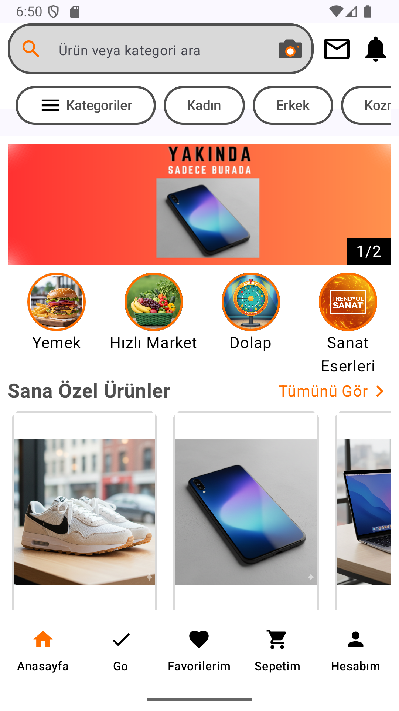

This is a design project

* **Modern UI:** Built entirely with **Jetpack Compose** for a declarative and scalable user interface.
* **Intuitive Navigation:** Utilizes **Bottom Navigation Bar** for seamless switching between main screens (Home, Categories, Cart, Profile, etc.).
* **State Management:** Demonstrates efficient state handling using Compose's observable state features.

## Application Main Screen

##  Uyarı ve Feragatname (Eğitim Amaçlı Kullanım)

Bu proje, mevcut bir e-ticaret platformundan **esinlenilerek** geliştirilmiş, **ticari olmayan ve tamamen eğitim amaçlı bir klon/yeniden tasarım** çalışmasıdır.

* **Geliştirme Amacı:** Proje, yalnızca **kişisel gelişim, Jetpack Compose yeteneklerinin gösterilmesi** ve TechCareer kursunun bitirme gereksinimi olarak yapılmıştır.
* **Ticari Amaç Yoktur:** Bu uygulamanın herhangi bir ticari kullanımı, satışı veya dağıtımı **amaçlanmamıştır**.
* **Bağlantı Yoktur:** Projenin esinlenildiği orijinal şirket, markaları veya ticari unvanları ile **resmi bir bağlantısı, onayı veya sponsorluğu bulunmamaktadır.**
* **Telif Hakları:** Kullanılan tüm harici marka adları, logolar ve ticari markalar (varsa), ilgili sahiplerinin mülkiyetindedir.

##  Disclaimer (Non-Commercial / Educational Use)

This project is a **non-commercial, educational clone/re-design** inspired by an existing e-commerce platform. It was developed solely for **self-improvement, demonstration of Jetpack Compose skills, and as a final project for the TechCareer course.**

* **No Commercial Intent:** This application is **not** intended for commercial use, sales, or distribution.
* **No Affiliation:** We are **not** affiliated with, endorsed by, or officially connected with the original company or its trademarks.
* **Copyrights:** All external brand names, logos, and trademarks used (if any) are the property of their respective owners.